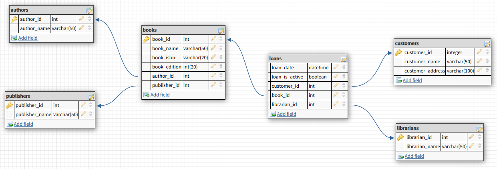

# Bibbrary
> Gestion d'une bibliothèque fictif en l'Ajax

- Le site utilise la base de données fournie par [Pluralsight](https://github.com/gacanepa/pluralsight/blob/master/03%20-%20Data%20Query%20Language/create_populate_db.sql)
- La structure adopté est celle [d'ici](https://php-html.net/tutorials/model-view-controller-in-php/)

## Consigne

- ...
